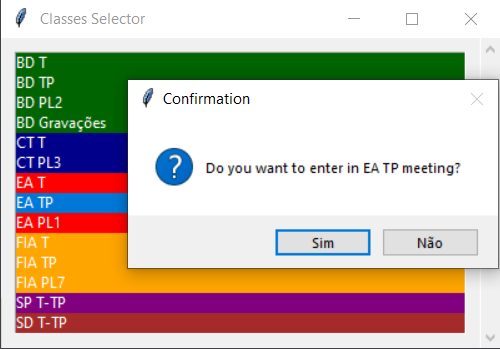
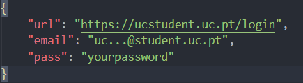
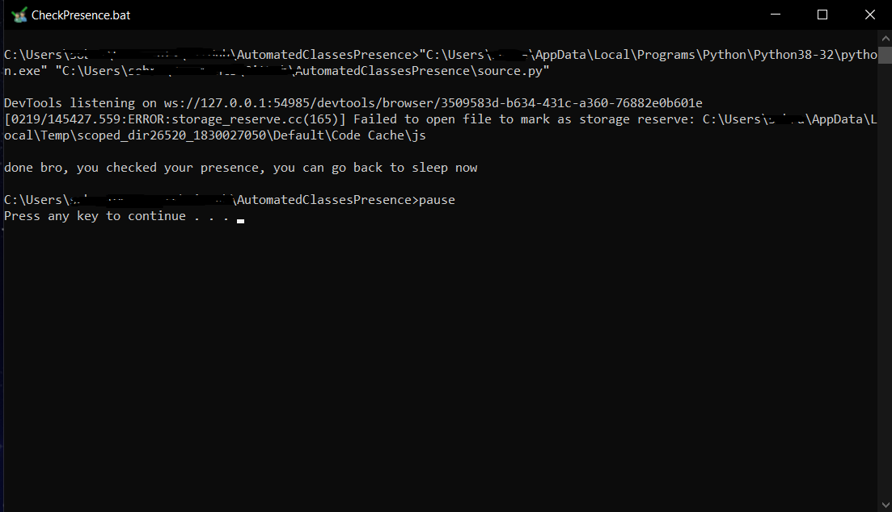
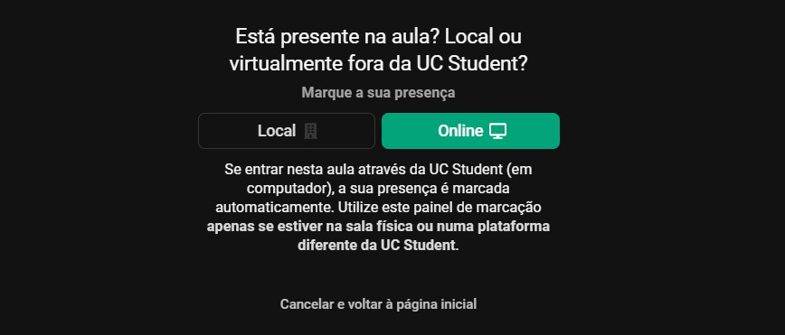

# Automated Classes
___ 
## Classes Accesser
### Technologies Used :computer:

1) **Visual Studio Code**

2) **Python**

3) **JSON**

3) **Python Libraries**

    1) ***webbrowser***
    2) ***tkinter***

### About
This is also a quiet simple script to make once again what I am lazy to do. Search for my Zoom URL everytime I want to enter a meeting. So, let's make our life easier once again too.

:warning: **`THIS ONE WORKS FOR ANY BROWSER`** :warning:

### Configure and Run it
To make it run you only need to:
1) Open this [executable](ClassesAccesser/AccessClass.bat) and change both directories (python compiler and script) to your own directories
2) And voilá, now, you only have to hurry up to don't lose your class :smile:
3) [Optional] you can adapt your URL links and classes name, changing them on this [JSON file](ClassesAccesser/URLDatabase.json)

___
# Presences Checker

### Technologies Used :computer:

1) **Visual Studio Code**

2) **Python**

3) **Selenium**

### About
This is a quite simple script to make what I am lazy to do. Check my presence during my university online classes.

:warning: **`FOR NOW, IT ONLY WORKS FOR MICROSOFT EDGE BROWSER`** :warning:

### Configure and Run it
To make it works you only need to:
1) Open the [JSON file](PresencesChecker/DataFile.json) and define your `email` and `password`

2) Open this [executable](PresencesChecker/CheckPresence.bat) and change both directories (python compiler and script) to your own directories
3) And voilá, you have your presence checked :smile:

___
## **Contributors** :sparkles:

<html><i><b>@2021</b></i></html>

***[Rodrigo Fernando Henriques Sobral](https://github.com/RodrigoSobral2000)***
___
## License :link:
Have a look at the [license file](LICENSE) for details
___
